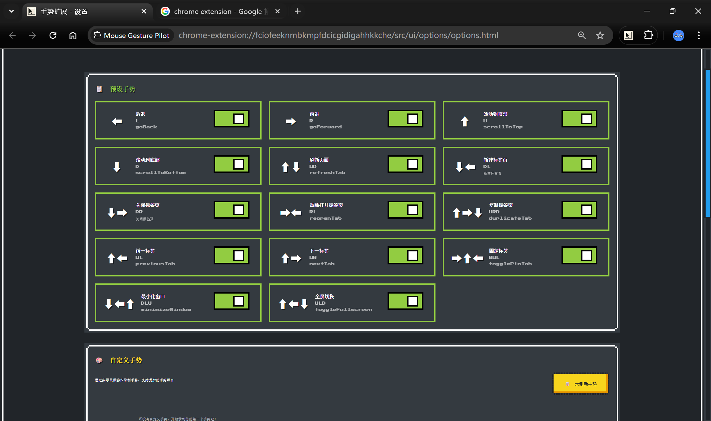
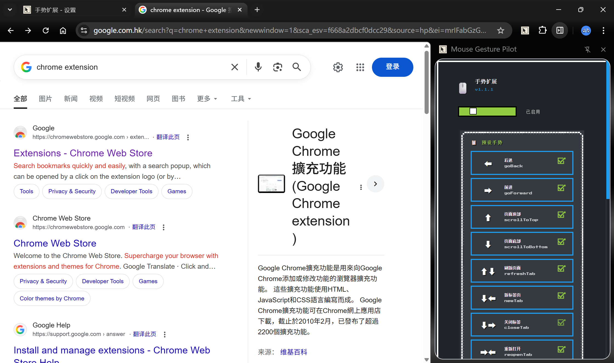
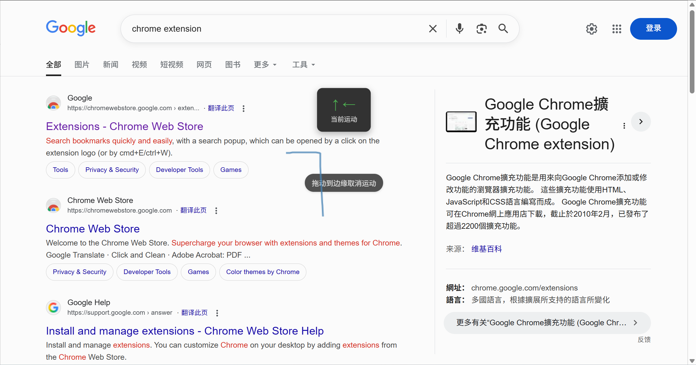
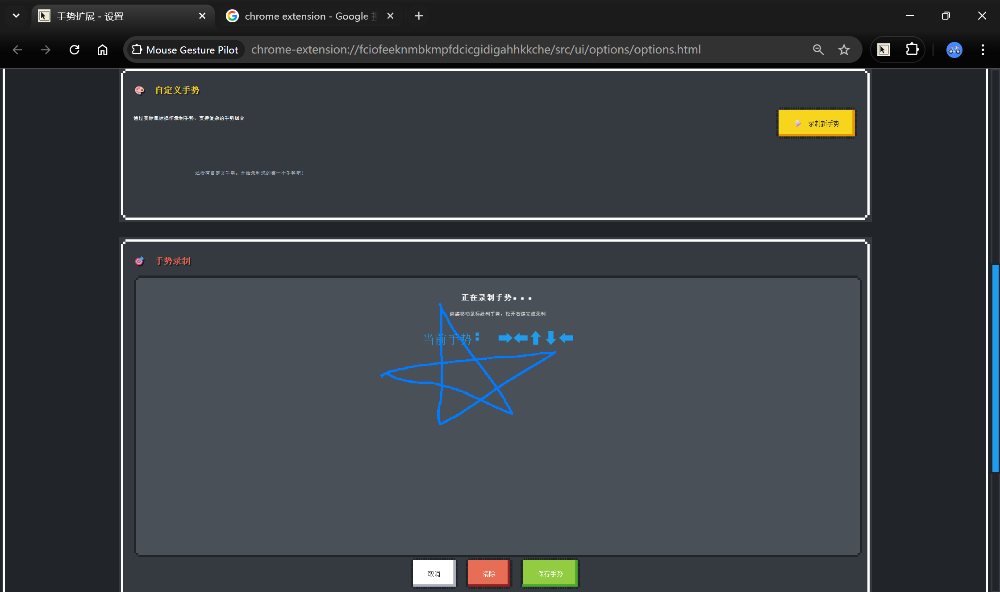

# Mouse Gesture Pilot 🖱## 📸 功能展示

### ### 设置页面
完整的配置选项，灵活调整手势行为



## 🚀 快速开始板
一个功能强大的 Chrome 鼠标手势扩展，支持可视化轨迹效果。

## 🎥 视频演示

[](https://www.youtube.com/watch?v=j6URBDnqozA)

📺 [**点击观看完整演示视频**](https://www.youtube.com/watch?v=j6URBDnqozA)

[](https://chrome.google.com/webstore)
[](https://opensource.org/licenses/MIT)
[](https://github.com/zhangsong-github/mouse-guesture-crx)

## ✨ 特性

- 🎯 **直观的鼠标手势识别** - 支持上下左右及组合手势
- 🌈 **可视化轨迹效果** - 实时显示手势轨迹
- ⚡ **14+ 预设手势** - 常用操作一键完成
- 🎨 **自定义手势** - 创建您自己的手势映射
- 📱 **侧边栏面板** - 快速查看和管理手势
- 🔧 **完整的配置选项** - 灵活调整灵敏度和行为
- 🌍 **多语言支持** - 中文/英文界面

## � 功能展示

### 侧边栏控制面板
快速查看和管理您的鼠标手势设置



### 页面手势操作
在任意网页中使用鼠标手势，实时显示轨迹效果



### 自定义手势
创建您专属的手势映射



### 设置页面
完整的配置选项，灵活调整手势行为


## 🚀 快速开始

### 方式一：下载Release版本安装（推荐）

这是最简单的安装方式，无需构建环境。

1. **下载最新版本**
   - 访问 [Releases页面](https://github.com/zhangsong-github/mouse-guesture-crx/releases)
   - 下载最新版本的 `mouse-gesture-v*.*.*.zip` 文件

2. **解压文件**
   - 将下载的 ZIP 文件解压到任意文件夹
   - 记住解压后的文件夹位置

3. **安装到 Chrome**
   - 打开 Chrome 浏览器
   - 访问扩展管理页面：`chrome://extensions/`
   - 在页面右上角启用 **"开发者模式"**
   - 点击左上角的 **"加载已解压的扩展程序"** 按钮
   - 选择刚才解压的文件夹
   - 点击"选择文件夹"完成安装

4. **开始使用**
   - 安装完成后，可以在浏览器工具栏看到扩展图标
   - 点击图标打开侧边栏，查看手势列表
   - 在任意网页按住鼠标右键并移动即可使用手势

> 💡 **提示**：扩展会一直保持安装状态，即使重启浏览器也不会消失。如需更新，下载新版本后重复上述步骤即可。

#### 📸 安装步骤图解

**步骤1**: 访问 chrome://extensions/ 并启用开发者模式
```
Chrome浏览器 → 右上角⋮菜单 → 扩展程序 → 管理扩展程序 → 开启"开发者模式"开关
```

**步骤2**: 点击"加载已解压的扩展程序"
```
在扩展管理页面左上角找到此按钮，点击后选择解压的文件夹
```

**步骤3**: 开始体验
```
扩展安装后会自动启用，可以在任意网页测试手势功能
```

#### ⚠️ 常见问题

<details>
<summary><b>为什么需要开启"开发者模式"？</b></summary>

因为这是手动安装的扩展，不是从Chrome Web Store下载的。开发者模式允许加载本地扩展文件。这不会影响浏览器的安全性。
</details>

<details>
<summary><b>扩展会被自动删除吗？</b></summary>

不会。手动安装的扩展会永久保留，除非你主动删除。重启浏览器后扩展依然正常工作。
</details>

<details>
<summary><b>如何更新到新版本？</b></summary>

1. 下载新版本的ZIP文件并解压到新文件夹
2. 在扩展管理页面点击"更新"按钮，或重新加载扩展
3. 也可以先删除旧版本，再安装新版本
</details>

<details>
<summary><b>在哪些页面可以使用手势？</b></summary>

几乎所有普通网页都支持。但Chrome内置页面（如 chrome://extensions/、chrome://settings/ 等）和Chrome Web Store页面出于安全限制无法使用扩展。
</details>

### 方式二：从源码构建安装

适合开发者或想要自定义的用户。

1. **克隆仓库**
   ```bash
   git clone https://github.com/zhangsong-github/mouse-guesture-crx.git
   cd chrome-guesture-extension
   ```

2. **安装依赖**
   ```bash
   npm install
   ```

3. **构建扩展**
   ```bash
   # 开发模式（包含 source maps）
   npm run build:dev
   
   # 生产模式（压缩优化）
   npm run build:prod
   ```

4. **加载到 Chrome**
   - 打开 Chrome 扩展管理页面 `chrome://extensions/`
   - 启用"开发者模式"
   - 点击"加载已解压的扩展程序"
   - 选择项目中的 `dist` 目录

## 📋 预设手势

| 手势 | 动作 | 说明 |
|------|------|------|
| ← | 后退 | 返回上一页 |
| → | 前进 | 前进到下一页 |
| ↑ | 滚动到顶部 | 页面滚动到顶部 |
| ↓ | 滚动到底部 | 页面滚动到底部 |
| ↑↓ | 刷新页面 | 重新加载当前页面 |
| ↓← | 新建标签页 | 打开新标签页 |
| ↓→ | 关闭标签页 | 关闭当前标签页 |
| →← | 重新打开 | 恢复最近关闭的标签页 |
| ↑→↓ | 复制标签页 | 复制当前标签页 |
| ↑← | 前一标签 | 切换到前一个标签页 |
| ↑→ | 后一标签 | 切换到后一个标签页 |
| →↑← | 固定标签 | 固定/取消固定标签页 |
| ↓←↑ | 最小化窗口 | 最小化当前窗口 |
| ↑←↓ | 全屏切换 | 切换全屏模式 |

## 🎨 使用方法

### 基本操作
1. **按住鼠标右键** 并移动鼠标绘制手势
2. 松开鼠标右键完成手势
3. 扩展会识别并执行对应动作

如下图所示，在页面中使用手势时会显示实时轨迹：


### 自定义手势
1. 点击扩展图标打开侧边栏
2. 进入"选项"页面
3. 点击"添加自定义手势"
4. 绘制您的手势并选择动作
5. 保存即可使用

自定义手势界面：


### 配置选项
- **识别灵敏度**: 调整手势识别的精确度
- **轨迹持续时间**: 设置轨迹显示时长
- **启用/禁用**: 快速切换手势功能

通过侧边栏控制面板可以快速访问所有功能：


## 🛠️ 开发

### 项目结构
```
chrome-guesture-extension/
├── src/
│   ├── background/        # Background Service Worker
│   ├── content/           # Content Scripts
│   ├── core/              # 核心功能模块
│   ├── ui/                # UI 组件
│   │   ├── options/       # 选项页
│   │   └── sidepanel/     # 侧边栏
│   └── utils/             # 工具函数
├── manifest.json          # 扩展配置
├── vite.config.js         # 构建配置
└── package.json
```

### 开发命令
```bash
# 开发模式（监听文件变化）
npm run dev

# 开发构建
npm run build:dev

# 生产构建
npm run build:prod

# 清理构建文件
npm run clean

# 验证配置
npm run validate
```

### 技术栈
- **Manifest V3** - 最新 Chrome 扩展标准
- **Vanilla JavaScript** - 无框架依赖
- **Vite** - 现代化构建工具
- **NES.css** - 像素风格 UI 库

## 📦 构建

构建后的文件位于 `dist/` 目录，包含：
- 压缩和优化的 JavaScript
- 静态资源文件
- manifest.json 配置

## 🤝 贡献

欢迎贡献！请随时提交 Pull Request。

1. Fork 本仓库
2. 创建您的特性分支 (`git checkout -b feature/AmazingFeature`)
3. 提交您的更改 (`git commit -m 'Add some AmazingFeature'`)
4. 推送到分支 (`git push origin feature/AmazingFeature`)
5. 打开 Pull Request

## 📄 许可证

本项目采用 MIT 许可证 - 查看 [LICENSE](LICENSE) 文件了解详情

## 🔒 安全说明

本仓库不包含任何私钥或扩展签名密钥。`manifest.json` 中的 `key` 字段已被移除以保护开发者隐私。

如果您 fork 此项目并需要固定的扩展 ID，请在本地生成您自己的密钥，但**不要**将其提交到 Git。

## 📧 联系方式

- GitHub: [@zhangsong-github](https://github.com/zhangsong-github)
- Email: zhangsongai3@gmail.com

## 🙏 致谢

感谢所有为这个项目做出贡献的开发者！

---

**注意**: 此扩展正在积极开发中。如果遇到问题，请在 [Issues](https://github.com/zhangsong-github/mouse-guesture-crx/issues) 页面报告。
